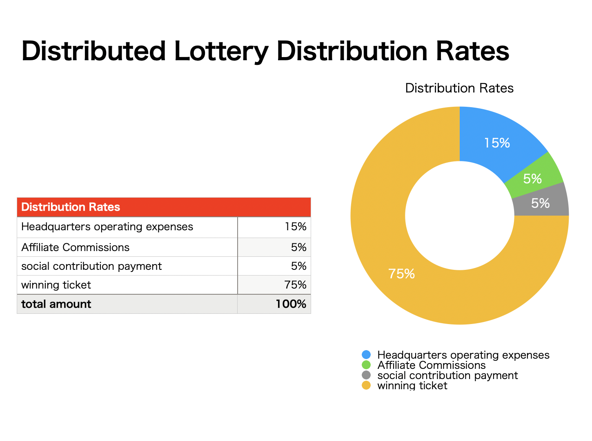
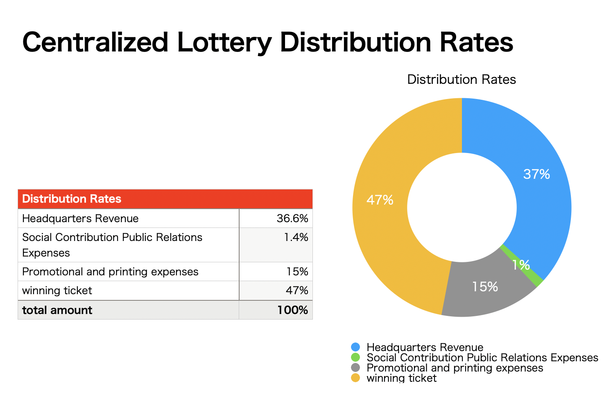
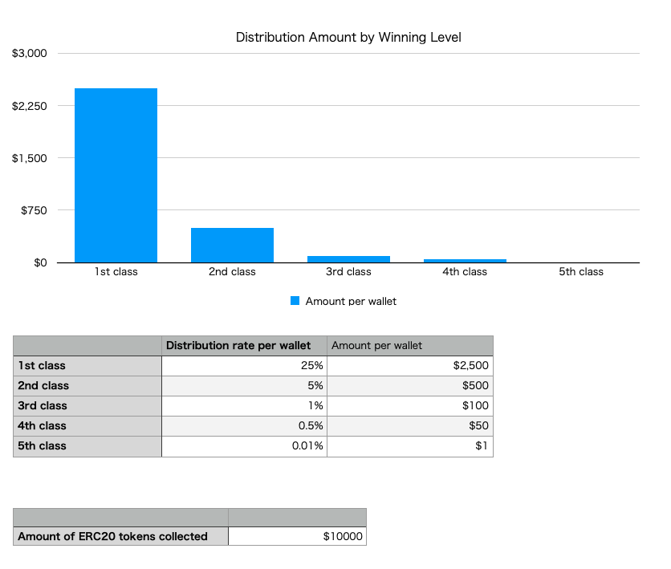

# CryptoLottery


# Overview
CryptoLottery is a decentralized lottery using crypto assets and smart contracts.
ERC20 tokens collected from users are distributed to random winners.
When users send money to the lottery, they can choose where to donate it, and a portion of the lottery proceeds are used for non-profit causes determined by a vote.

While regular lotteries offer a return rate of about 50%, the
CryptoLottery will return 75% to users, 5% to affiliate users, and the remaining 15% to revenue and 5% to non-profit expenses.

Lottery proceeds will be used for the following
- Operated by DeFi
- PR activities
- Development funds
- Building an ecosystem
- Dividends to staking wallets

The CryptoLottery organization will work towards becoming a fully DAO (self-sustaining decentralized organization).

# Vision
Decentralized lotteries improve society

# Challenges of centralized lotteries
- Lack of transparency.
- Low distribution rate.
- A portion of profits is used for social contributions, but where to donate is centrally determined.
- The amount of money spent on sales promotion is high.
- Paper lottery is not good for the environment.
- When you win a prize, you have to go to the bank to pick it up.

# Solutions and functions to solve the problems
- Transparent determination of winners
- High distribution rate
- Affiliates reduce promotion costs
- Vote on where to donate proceeds when purchasing lottery tickets
- DAO-ization
- Winnings are automatically transferred to your wallet when you win.

## Transparent winner determination
Since random numbers are generated on the blockchain, winners can be determined transparently.

## High distribution rate

Advantages of decentralized lotteries
- Low operating costs
- Affiliate functionality keeps promotional costs low.
- Winning money is high.
- Social contribution expenses are high, and the recipients of the funds are determined by the votes cast.



Disadvantages of a centralized lottery
- A high percentage of the headquarters' revenues.
- Printed on paper, which is expensive to print and bad for the environment.
- Social contribution PR expenses are low, and the recipients of the funds are centrally determined.
- The amount of winning money is small.

This is an example of a Japanese lottery.



## Reduce promotional costs with affiliates
Affiliates can refer users to CrytoLottery and receive a sales commission when users buy lottery tickets.

Affiliates need to staking CryptoLottery's ERC20 tokens above a certain amount to participate.
5% of the amount of lottery tickets purchased is paid to the affiliate as an affiliate commission. If not through an affiliate, the funds are paid to the CryptoLottery management.
Therefore, lottery participants pay the same amount of money whether they participate through an affiliate or directly from the CryptoLottery management website.

## Vote for where to donate the proceeds when you buy your lottery ticket
When purchasing lottery tickets, users select the SDG goals they want to achieve
For each goal, select an organization that is active in that area.


After the lottery is over, a portion of the proceeds will be immediately remitted to the organization determined by the vote.
This speedy approach to philanthropy makes society more peaceful and prosperous.

Charitable organizations can apply to CryptoLottery to have their profile and wallet address placed on the donation list.

## DAO-ized
Governance token holders set the policy for the application.
The owner organization handles marketing activities and development.
Staking will receive a portion of the proceeds.

## When you win, the money is automatically transferred to your wallet.
Japanese lottery tickets require a person to bring identification to a bank on a weekday at noon for a large lottery win.
With blockchain, the money is automatically transferred to your wallet when you win and can be used on the same day.

Some foreign lotteries are forfeited if you do not pick up your lottery ticket within 7 days of the winning date.
By having the money sent automatically, you will not forget to get it.

# Ecosystem
We're going to turn this ecosystem around.
Social Action, DeFi, Lottery, Contribution to the Blockchain Network

## Operate with DeFi using funds applied by the lottery
Set up a weekly lottery, with a slightly higher chance of winning if deposited in the lottery on the first day of the week. Allow more funds to be collected on the first day of the week.
The collected ERC20 tokens will be invested in uniswap or other means to generate income.

# How to use the lottery participants
You can purchase CryptoLottery tokens on exchanges or DeFi and
There are daily, weekly, monthly, and annual lottery smart contracts, so you can deposit funds into whichever one you like.
You vote on how you want to spend your social contribution funds.
Once you have deposited your funds, you will be shown how likely you are to win.
On the day of the winner, a winner will be chosen at random and the money will be automatically transferred to the winner.
The money will be sent to the organization that will spend the social contribution activity funds as determined by the voting.

# Marketing Strategy
Free lottery tickets will be given out to users who retweet and follow CryptoLottery on Twitter without having to buy a CryptoLottery lottery ticket.

# Winning amount simulation



# Development Plan

2022Q2 Make lottery tickets available using CryptoLottery (ERC20) tokens, conduct bug bounty
2022Q3 DeFi operation to lock funds for the lottery, with other ERC20 tokens, to be made available as a lottery ticket
2022Q4 Make lottery tickets available with the winning prize as NFT

# ICO Plan

2022Q3 ICO

Total amount issued: To be determined
Supply: not yet determined

# SDGs
A global, decentralized, trustless lottery to achieve the SDGs (Sustainable Development Goals).


# Lottery Market Size

Japan: 786.6 billion yen FY2018
Cited from: https://www.soumu.go.jp/main_content/000583736.pdf

World: $200 billion

The global lottery market size will increase by US$19.414 billion from 2020 to 2025.
Quote: https://www.prnewswire.com/news-releases/lottery-market-size-to-grow-by-usd-194-14-bn--38-of-the-growth-from-apac--17-000-technavio-reports-301501174.html

# Lottery laws in each country

## Lottery laws in major developed countries
### Japan
The issuance of lottery tickets for sale by ordinary individuals or companies is prohibited under Article 187 of the Penal Code.
Lottery tickets can be sold by the national prefectures and 20 designated cities, i.e., local governments, as stipulated in the Lottery Law "Lottery Prize Certificate Law" (enacted in 1948). These local governments are authorized by the Minister of Internal Affairs and Communications to act as ticket sellers and outsource ticket sales and other operations to banks and other financial institutions.

Reference: https://www.takarakuji-official.jp/about/structure.html

### U.S.A.
As in Japan, lotteries issued by local governments are permitted.
Cited from: https://en.wikipedia.org/wiki/Lotteries_in_the_United_States#States_with_no_lotteries

### Dubai
Although prohibited for religious reasons, there are some government-issued lotteries.
The Multi Millionaire lottery is sold at the Dubai and Abu Dhabi airports, where the winner receives $1 million and other prizes such as cars and motorcycles are given away.
Quote from: http://www.dubaicityguide.com/m/features/index.asp?id=8876#.YjatFJPP30o


## Areas where virtual currency and online casinos are legal

- Republic of Malta
- Gibraltar (United Kingdom)
- Isle of Man
- Alderney Island
- Iceland
- Canada (Kanawake)
- Curaçao Island

### The most promising is Malta
Lotteries are not regulated and issue licenses for online casinos.
You can start a lottery business without an online casino license, but a license gives you more credibility.
Cited from: https://thelawreviews.co.uk/title/the-gambling-law-review/malta


ICO with virtual currency is possible if you apply for it.
Quote from: https://www.csbgroup.com/fintech/initial-coin-offering-ico-malta/

# Members

Seiya Takahashi
24, is a representative of Outsource Systems, Inc. He has experience in system development for various companies.
He develops web services using modern development tools (Rails, React, AWS).
He became interested in Bitcoin in 2016, learned the concept of blockchain, and started working with Solidity in 2020.

github: https://github.com/PeterTakahashi

twitter: https://twitter.com/_PeterTakahashi


## Members wanted

CFO
Fundraising, Finance

CTO
Smart contract development in Solidity
Front-end development with React

CMO
Marketing, PR

CCO
Community management such as DISCORD

Welcome Requirements
All in both English and Japanese or English only


# For technical specifications
## Tools used
Solidity
Hardhat
Alchemy

## Blockchain network
Developed in Solidity and can be used with Ethereum, Binance, Polygon, Avalanche, etc.

## Mechanism to ensure randomness of winnings
Chainlink VRF can be used to get random numbers that can be verified on the blockchain.
https://docs.chain.link/docs/chainlink-vrf/

Chainlink VRF has been used by PancakeSwap and PoolTogether.

### PancakeSwap
Lottery operated by DeFi on the Binance Smart Chain
https://pancakeswap.finance/lottery

### PoolTogether
No-loss lotteries, DeFi pooled profits to be distributed by lottery to pooled users
https://PoolTogether.com/


## About Lottery Smart Contracts
The CryptoLottery, an ERC20 token, is used to play the lottery.

The smart contract for playing the lottery is based on `TimedRandomSendContract`.
https://github.com/PeterTakahashi/CryptoLottery/blob/main/contracts/TimedRandomSendContract.sol

```js
name // name of the lottery (e.g., WeeklyLottery)
symbol // short name of the lottery (e.g., WLT)

// 1 day is 86400 seconds, so 1 week is 86400 * 7
cycle // Lottery cycle uinxtime (e.g. 86400 * 7)

closeTimestamp // Lottery closing time unixtime (e.g. block.timestamp + 86400 * 7)

erc20 // ERC20 token used in the lottery

randomSendingRules // how many people have what percentage chance of winning

// How much money to send to which address at the time of the lottery's closing date
// Mainly put in the address of the operating headquarters, etc.
DeFinitelySendingRules
````
