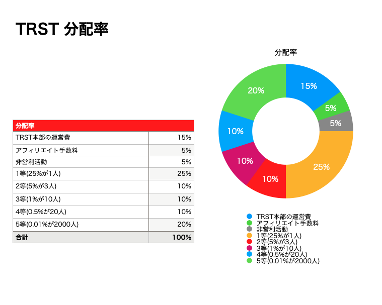
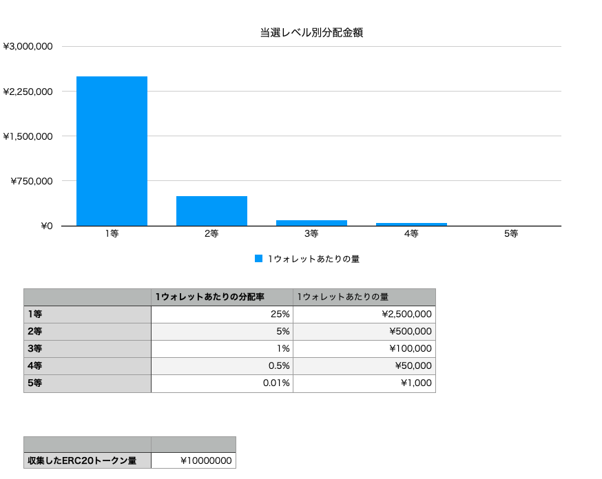

# CryptoLottery

# 概要
CryptoLotteryは暗号資産を使用した分散型宝くじです。
ユーザーから収集したERC20トークンをランダムな当選者に分配します。
ユーザーは宝くじに送金する時に、寄付先を選択でき、宝くじの収益の一部を投票によって決めた非営利活動に使います。

通常の宝くじでは、還元率が50%ほどですが、
CryptoLotteryでは、ユーザーへの還元率を75%にして、アフィリエイトユーザーに5％、残り15%を収益、非営利活動費を5%にします。

宝くじの収益は下記に使います。
- Defiで運用
- PR活動
- 開発資金

CryptoLotteryの組織は完全にDAO(自立分散型組織)化することを目指して活動をします。

# 中央集権的な宝くじの課題
- 透明性がない。
- 分配率が低い。
- 利益の一部を社会貢献に使われているが、どこに寄付するかは中央集権的に決められている。
- 販売促進にかける金額が多い。

# 課題を解決するソリューション・機能
## 透明性のある当選者決定
ブロックチェーン上で乱数を生成するので、透明性のある当選者決定ができる。

## 分配率の高さ
DAO化することにより予算が集めやすく、ブロックチェーン上で行うので、サーバー費用などの予算が少ない。アフィリエイト機能を使うことにより紹介するインセンティブを与えて、マーケティング費用を抑えている。



## アフィリエイト
宝くじチケットを購入した金額の5%をアフィリエイト手数料として、アフィリエイターに支払う。アフィリエイター経由でない場合は、その資金はCryptoLottery運営に支払われる。
なので、宝くじの参加者はアフィリエイター経由でも、直接CryptoLottery運営のサイトから参加しても、支払う金額は同じになる。

## 宝くじチケットを購入するときに寄付先を決める

## DAO化
ガバナンストークンを持っている人が、アプリケーションの方針を決める。
マーケティング活動や開発をオーナー組織が行う。
ステーキングをすると収益の一部が貰える。

## 宝くじ収益と宝くじにかけられている資金を使ってDefiで運用

## 使い方
取引所やDeFiでCryptoLotteryトークンを購入して、
日間、週間、月間、年間のCryptoLotteryスマートコントラクトがあるので、好きなものに資金を預けます。
資金を預けたら、どれくらいの確率で、当選するのか確認できます。

## どのブロックチェーンネットワークで使えるのか？
Solidityで開発しているので、Ethereum、Binance、Polygon、Astar Network, Avalancheなどで使用可能です。

# マーケティング戦略
CryptoLotteryの宝くじチケットを買わなくても、Twitterでリツイート、フォローしたユーザーに、宝くじチケットを無料で配ります。

## 技術仕様について
Solidity
Hardhat
Alchemy

## ランダム性を担保する仕組み
Solidityでランダム性を担保するのは難しいです。なぜなら、全てのブロックチェーンのノードが同じ値を返すため、Rand関数が、Solidityにはないからです。
そこで、下記のような代替するランダム関数を作成しました。
参加者や参加者の中間地点のアドレス、ERC20がトータルでいくら集まるかは、締め切りの時間が来るまでどのユーザーにもわかりません。

```
((参加者数 + ブロックタムスタンプ(現在時刻) + 参加者の人数の中間地点のユーザーのアドレス) % 参加者数) + ERC20が集まった量) % 参加者数
```

このような仕組みを使うことでランダム性を担保することができます。

## 当選金額シュミレーション



## 技術者向け仕様
CryptoLotteryというERC20トークンを使って宝くじを行う。

宝くじを行うスマートコントラクトは`TimedRandomSendContract`をベースにて、作られている。

```js
name // 宝くじの名前 (例: WeeklyLottery)
symbol // 宝くじの短い名前 (例: WLT)

// １日が86400秒なので1週間だと 86400 * 7 になる
cycle // 宝くじの周期 uinxtime (例: 86400 * 7)

closeTimestamp // 宝くじの締め時間 unixtime (例: block.timestamp + 86400 * 7)

erc20 // 宝くじに使用されるERC20トークン

randomSendingRules // 何人に何%の確率で当選させるか

// 宝くじの締め日時にどのアドレスにどのくらい送金するのか
// 主に運営本部ののアドレスなどを入れます。
definitelySendingRules 
```

