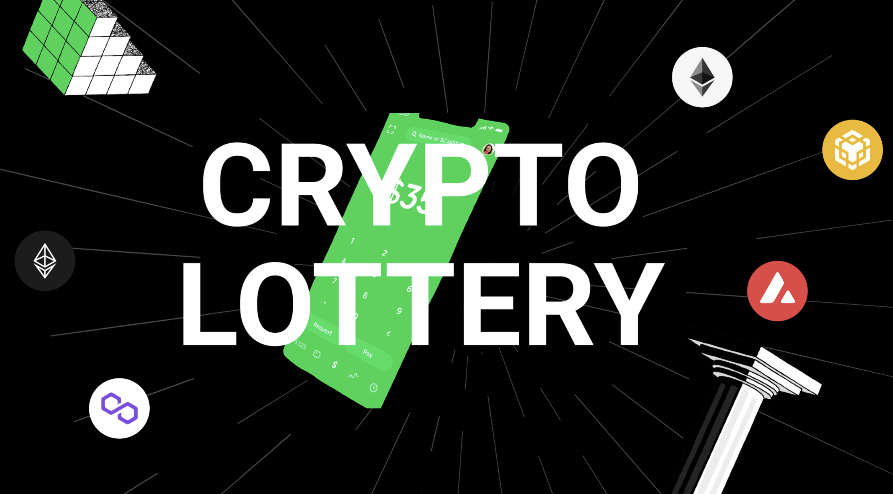

# CryptoLottery



# 概要
CryptoLotteryは暗号資産とスマートコントラクトを使用した分散型宝くじです。
ユーザーから収集したERC20トークンをランダムな当選者に分配します。
ユーザーは宝くじに送金する時に、寄付先を選択でき、宝くじの収益の一部を投票によって決めた非営利活動に使います。

通常の宝くじでは、還元率が50%ほどですが、
CryptoLotteryでは、ユーザーへの還元率を75%にして、アフィリエイトユーザーに5％、残り15%を収益、非営利活動費を5%にします。

宝くじの収益は下記に使います。
- DeFiで運用
- PR活動
- 開発資金
- エコシステムの構築
- ステーキングウォレットへの配当

CryptoLotteryの組織は完全にDAO(自立分散型組織)化することを目指して活動をします。

# ビジョン
分散型宝くじで社会をより良くする

# 中央集権的な宝くじの課題
- 透明性がない。
- 分配率が低い。
- 利益の一部を社会貢献に使われているが、どこに寄付するかは中央集権的に決められている。
- 販売促進にかける金額が多い。
- 紙くじは環境に良くない。
- 当選したら銀行に取りに行く必要がある。

# 課題を解決するソリューション・機能
- 透明性のある当選者決定
- 高い分配率
- アフィリエイトで販売促進コストの削減
- 宝くじチケットを購入する時に収益の寄付先を投票する
- DAO化
- 当選したら自動でウォレットに送金される

## 透明性のある当選者決定
ブロックチェーン上で乱数を生成するので、透明性のある当選者決定ができる。

## 高い分配率

分散型の宝くじのメリット
- 運営費が少ない
- アフィリエイト機能を使うことで販促費用を抑えている
- 当選金が多い
- 社会貢献費が多い、利用先は投票によって決まる。


中央集権的な宝くじのデメリット
- 本部の収益の比率が高い。
- 紙で印刷しているので印刷費用もかかり、環境に悪い。
- 社会貢献広報費が少なく、利用先は中央集権的に決められている。
- 当選金の金額が少ない。

※ こちらは日本の宝くじの例にしています。


## アフィリエイトで販売促進コストの削減
アフィリエイターはCrytoLotteryを紹介して、ユーザーが宝くじを買うことで、販売手数料をもらうことができる。

アフィリエイトに参加するには一定の以上のCryptoLotteryのERC20トークンをステーキングする必要がある。
宝くじチケットを購入した金額の5%をアフィリエイト手数料として、アフィリエイターに支払う。アフィリエイター経由でない場合は、その資金はCryptoLottery運営に支払われる。
なので、宝くじの参加者はアフィリエイター経由でも、直接CryptoLottery運営のサイトから参加しても、支払う金額は同じになる。

## 宝くじチケットを購入する時に収益の寄付先を投票する
宝くじチケットを購入する時にユーザーは達成したいSDGsの目標を選択
目標ごとにその分野で活動している団体を選択します。


宝くじが終了後、投票によって決められた団体に収益の一部を即時に送金をします。
このスピード感のある慈善事業への取り組みは、社会をより平和で豊かなものにします。

慈善団体はCryptoLotteryに申請をすると、プロフィールとウォレットアドレスを寄付先に載せることができます。

## DAO化
ガバナンストークンを持っている人が、アプリケーションの方針を決める。
マーケティング活動や開発をオーナー組織が行う。
ステーキングをすると収益の一部が貰える。

## 当選したら自動でウォレットに送金される
日本の宝くじの場合、高額当選の場合、平日の昼に銀行に身分証明書を持参する必要がある。
ブロックチェーンを使えば、当選したら自動でウォレットに送金されて、その日に使える。

海外の宝くじの中には、当選日の7日以内に取りに行かないと、失効されてしまう宝くじもあります。
自動送金されることで、もらい忘れがなくなります。

# エコシステム
このエコシステムを回していく
社会貢献活動, DeFi, 宝くじ, ブロックチェーンネットワークへの貢献

## 宝くじでかけられている資金を使ってDeFiで運用
週間宝くじがあった場合、週の初日に宝くじに預けらた場合、当たる確率が少し高くなるように設定して。多くの資金を週の初日に集まるようにします。
集まったERC20トークンはuniswapなどで運用して収益を出します。

# 宝くじ参加者の使い方
取引所やDeFiでCryptoLotteryトークンを購入して、
日間、週間、月間、年間のCryptoLotteryスマートコントラクトがあるので、好きなものに資金を預けます。
資金を預けたら、どれくらいの確率で、当選するのか確認できます。
当選日になったら

# マーケティング戦略
CryptoLotteryの宝くじチケットを買わなくても、Twitterでリツイート、フォローしたユーザーに、宝くじチケットを無料で配ります。

# 当選金額シュミレーション


# 開発計画

2022Q2  CryptoLottery(ERC20)トークンを使用した宝くじを利用可能にする, バグバウンティの実施
2022Q3  宝くじのロック資金をDeFi運用, 他のERC20トークンで、宝くじとして利用可能にする
2022Q4  当選品をNFTにした宝くじを利用可能にする

# ICO計画

2022Q3 ICO

総発行量 未決定
供給量 未決定

# SDGs
SDGs(持続可能な開発目標)を達成するためにグローバルで分散化されたトラストレスな宝くじを利用します。


# 宝くじの市場規模

日本：　7,866億円 2018年度
引用元: https://www.soumu.go.jp/main_content/000583736.pdf

世界: 2000億ドル

世界の宝くじの市場規模は2020年から2025年まで、194.14億米ドル増加する。
引用元: https://www.prnewswire.com/news-releases/lottery-market-size-to-grow-by-usd-194-14-bn--38-of-the-growth-from-apac--17-000-technavio-reports-301501174.html

# 各国の宝くじの法律

## 主な先進国の宝くじの法律
### 日本
宝くじの発行を一般の個人や会社などが発売することは、刑法第187条で禁止されています。
宝くじを発売できるのは、宝くじの法律「当せん金付証票法」（昭和23年施行）に定められた全国都道府県と20指定都市、つまり地方自治体です。この地方自治体が、総務大臣の許可を得て発売元となり、発売等の事務を銀行等に委託しています。

引用元: https://www.takarakuji-official.jp/about/structure.html

### アメリカ
日本と同じで自治体が出す宝くじは許可されています。
引用元: https://en.wikipedia.org/wiki/Lotteries_in_the_United_States#States_with_no_lotteries

### ドバイ
宗教上の理由により禁止されているが、政府の発行する宝くじのようなものはあります。
マルチミリオネアという宝くじはドバイ、アブダビの空港で販売され、当選者は100万ドルを受け取り、車やオートバイなどの他の賞品が配られます。
引用元: http://www.dubaicityguide.com/m/features/index.asp?id=8876#.YjatFJPP30o


## 仮想通貨とオンラインカジノが合法な地域

- マルタ共和国
- ジブラルタル(イギリス)
- マン島
- オルダニー島
- アイスランド
- カナダ（カナワケ）
- キュラソー島

### 最有力なのはマルタ共和国
宝くじは規制されておらず、オンラインカジノのライセンスの発行も行なっている。
引用元: https://thelawreviews.co.uk/title/the-gambling-law-review/malta


仮想通貨によるICOは申請すれば可能
引用元: https://www.csbgroup.com/fintech/initial-coin-offering-ico-malta/

# メンバー

高橋聖弥 / Seiya Takahashi
24歳、株式会社アウトソースシステムズの代表。さまざまな企業でのシステム開発実績があリます。
モダンな開発ツール(Rails, React, AWS)を使ったwebサービス開発。
2016年にビットコインに興味を持ち、ブロックチェーンの概念を学び、2020年にSolidityに触れ始めました。

github: https://github.com/PeterTakahashi

twitter: https://twitter.com/_PeterTakahashi


## メンバー募集

CFO
資金調達、ファイナンス

CTO
Solidityでスマートコントラクト開発
Reactでフロントエンド開発

CMO
マーケティング,PR

CCO
discordなどのコミュニティ運営

歓迎条件
全て英語と日本語の両方または英語のみ


# 技術仕様について
## 使用ツール
Solidity
Hardhat
Alchemy

## ブロックチェーンネットワーク
Solidityで開発しているので、Ethereum、Binance、Polygon, Avalancheなどで使用可能です。

## 当選のランダム性を担保する仕組み
Chainlink VRFを使用するとブロックチェーン上で検証可能なランダムな数字を取得できます。
https://docs.chain.link/docs/chainlink-vrf/

Chainlink VRFはPancakeSwapやPoolTogetherなどの利用実績があります。

### PancakeSwap
バイナンススマートチェーン上のDeFiが運営している宝くじ
https://pancakeswap.finance/lottery

### PoolTogether
損失の出ない宝くじ、DeFiプールして得た利益をプールしたユーザーに抽選で分配する
https://PoolTogether.com/


## 宝くじスマートコントラクトについて
CryptoLotteryというERC20トークンを使って宝くじを行う。

宝くじを行うスマートコントラクトは`TimedRandomSendContract`をベースにて、作られている。
https://github.com/PeterTakahashi/CryptoLottery/blob/main/contracts/TimedRandomSendContract.sol

```js
name // 宝くじの名前 (例: WeeklyLottery)
symbol // 宝くじの短い名前 (例: WLT)

// １日が86400秒なので1週間だと 86400 * 7 になる
cycle // 宝くじの周期 uinxtime (例: 86400 * 7)

closeTimestamp // 宝くじの締め時間 unixtime (例: block.timestamp + 86400 * 7)

erc20 // 宝くじに使用されるERC20トークン

randomSendingRules // 何人に何%の確率で当選させるか

// 宝くじの締め日時にどのアドレスにどのくらい送金するのか
// 主に運営本部ののアドレスなどを入れます。
DeFinitelySendingRules 
```
